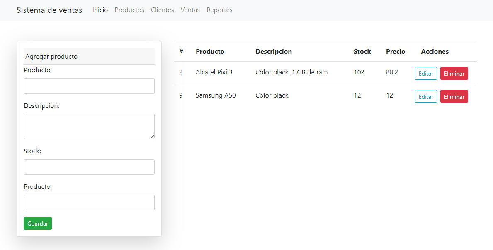

# App para ventas de productos
Esta es una aplicación básica que emula la venta de un producto.

Esta app realiza lo siguiente:

- CRUD operaciones: create/read/update/delete Producto
- Login en dev



### Instalación

```sh
git clone https://github.com/Jose-developer-start/systemVenta-express-reactjs.git
cd systemVenta-express-reactjs
npm i
npm run dev //Correr server API # run in development mode
npm start //Correr reactjs # run in production mode
```

> Gestor recomendado para MySQL (phpMyAdmin) or MariaDB Server

### Requisitos

-- MySQL
-- Nodejs and npm (GNU/linux)

- [Version 1]
- [En desarrollo]